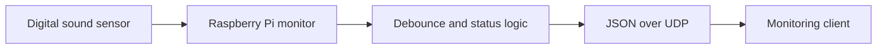

# Raspberry Pi Sound-Event Monitoring System

A client-server IoT prototype that detects digital sound events on a Raspberry Pi and sends structured UDP alerts to a monitoring client.

## What the prototype demonstrates

- Raspberry Pi GPIO sensor integration
- Debounced sound-event detection
- UDP communication between two devices
- Structured JSON event messages
- Configurable host, port, GPIO pin and timing
- Hardware-free simulation mode
- Automated tests for event and message behaviour

## Architecture



The sensor's digital output reports whether sound crossed the threshold configured on the physical sensor module. This prototype does **not** calculate calibrated decibel values. Accurate dB measurement would require calibrated analogue sampling and signal processing.

## Run without hardware

Start the client:

```bash
python client.py --host 127.0.0.1 --port 5005
```

In a second terminal, run the deterministic simulator:

```bash
python server.py --simulate --client-host 127.0.0.1 --port 5005
```

## Run on a Raspberry Pi

```bash
python -m pip install -r requirements.txt
python server.py --client-host <CLIENT_IP> --pin 17 --port 5005
```

Connect the digital output of the sound sensor to the configured GPIO pin and share a ground with the Raspberry Pi. Confirm the voltage requirements of the specific sensor before connecting it.

## Message format

```json
{"type":"sound_alert","detected":true,"timestamp":"2026-09-13T12:30:00+00:00"}
```

Status messages use `type: "status"` and `detected: false`.

## Tests

```bash
python -m unittest discover -s tests -v
```

The tests run on any computer because the decision logic does not import Raspberry Pi libraries.

## Limitations and next steps

- UDP does not guarantee delivery; acknowledgements or MQTT would improve reliability.
- The digital sensor indicates a threshold crossing, not sound intensity in dB.
- Messages are not authenticated or encrypted.
- Production deployment would add device identity, persistent event storage, monitoring and reconnection behaviour.

## Project attribution

This was a collaborative university project. Zandile Dladla contributed to sensor setup, development-environment preparation, Raspberry Pi debugging, testing and hardware/software integration. This repository is maintained as her portfolio version of the prototype.

Original team: Zandile Monalisa Dladla, Khaka Nyiba, Kevin Sesu Nkansah, Siziphiwe Dingiswayo, Joëlle Ambika Aganze, Raeez Ahmed, Luyanda Zameko, Mohammed Saleem Ali, Linathi Dumezweni and Sibongakonke Mpendulo Lushozi.

Portfolio: https://zandiledladla.github.io
